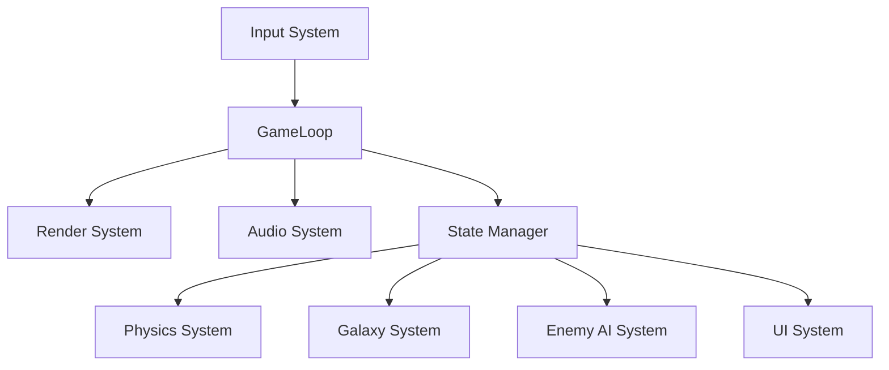

# System Architecture

## 1. System Architecture Overview

### High-Level Architecture



### Core Systems

1.  **Game Loop (60 FPS)**
    *   Input processing
    *   State updates
    *   Physics simulation
    *   AI processing
    *   Rendering
    *   Audio playback

2.  **State Manager**
    *   Current game state (Title, Playing, Paused, GameOver)
    *   State transitions
    *   State persistence

3.  **Galaxy System**
    *   256-sector grid
    *   Enemy positions
    *   Starbase locations
    *   Player position

4.  **Combat System**
    *   Torpedo firing
    *   Hit detection
    *   Damage calculation
    *   Lock indicators

5.  **Rendering System**
    *   3D projection
    *   Sprite rendering
    *   Particle effects
    *   HUD rendering

## 2. Game Engine Design

### Main Game Loop
The game targets a fixed 60 FPS update cycle.

```csharp
// Pseudocode
while (gameRunning) {
    deltaTime = currentTime - lastFrameTime;
    ProcessInput();
    UpdateGame(deltaTime);
    RenderFrame();
}
```

### State Machine
The game uses a finite state machine to manage high-level game states.

**Game States:**
*   `TITLE_SCREEN`
*   `DIFFICULTY_SELECT`
*   `PLAYING`
*   `PAUSED`
*   `GALACTIC_CHART`
*   `HYPERSPACE`
*   `DOCKING`
*   `GAME_OVER`
*   `RANKING`

## 3. State Management System

### Game State Data Structure
The `GameState` class holds all persistent data for the session.

*   **Player Data:** Position, Velocity, Energy, Kills, Sector (X, Y).
*   **Ship Systems (PESCLR):** Status of Photon, Engines, Shields, Computer, LongRange, Radio.
*   **Galaxy Data:** 16x16 Sector Grid, Starbase list, Enemy list.
*   **Session Data:** Difficulty, Mission Time, Score, Rank.

### Serialization
Game state is serialized to JSON for save/load functionality.

```csharp
// Pseudocode: Save/Load System
function SaveGame(slotNumber):
    saveData = {
        version: "1.0",
        timestamp: GetCurrentTimestamp(),
        difficulty: difficultyLevel,
        missionTime: missionTime,
        
        player: {
            sector: playerSector,
            position: playerPosition,
            velocity: playerVelocity,
            energy: playerEnergy,
            kills: playerKills
        },
        
        systems: {
            photon: systems.photon,
            engines: systems.engines,
            shields: systems.shields,
            computer: systems.computer,
            longRange: systems.longRange,
            radio: systems.radio
        },
        
        galaxy: SerializeGalaxy(),
        starbases: SerializeStarbases(),
        enemies: SerializeEnemies(),
        score: score
    }
    
    jsonString = JSON.stringify(saveData)
    WriteToFile("save_" + slotNumber + ".json", jsonString)

function LoadGame(slotNumber):
    jsonString = ReadFromFile("save_" + slotNumber + ".json")
    if jsonString == null: return false
    
    saveData = JSON.parse(jsonString)
    
    // Restore game state
    difficultyLevel = saveData.difficulty
    missionTime = saveData.missionTime
    
    // Restore player
    playerSector = saveData.player.sector
    playerPosition = saveData.player.position
    playerVelocity = saveData.player.velocity
    playerEnergy = saveData.player.energy
    playerKills = saveData.player.kills
    
    // Restore systems
    systems.photon = saveData.systems.photon
    systems.engines = saveData.systems.engines
    systems.shields = saveData.systems.shields
    systems.computer = saveData.systems.computer
    systems.longRange = saveData.systems.longRange
    systems.radio = saveData.systems.radio
    
    // Restore galaxy
    DeserializeGalaxy(saveData.galaxy)
    DeserializeStarbases(saveData.starbases)
    DeserializeEnemies(saveData.enemies)
    
    score = saveData.score
    return true
```
