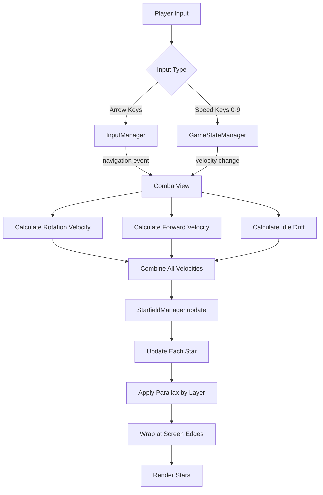
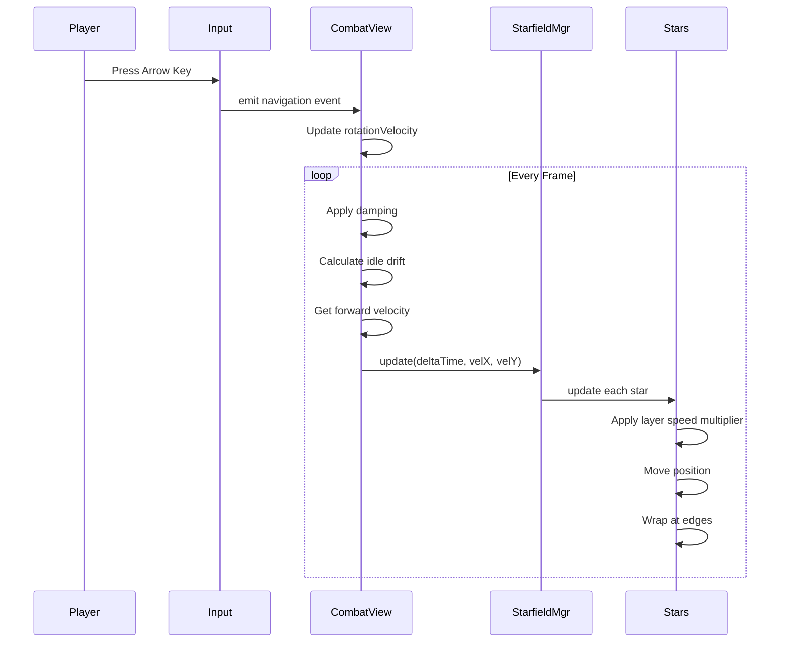
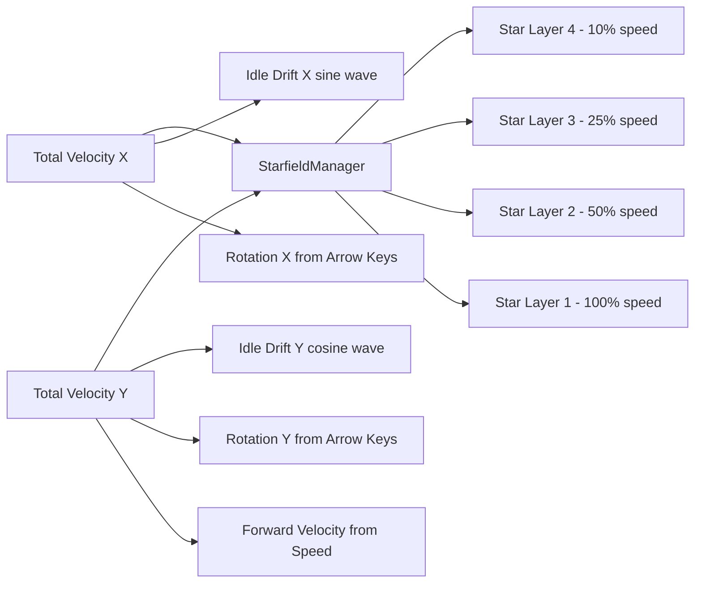
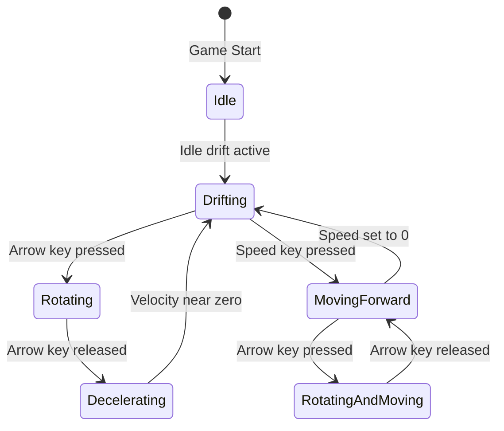

# Starfield Movement Architecture

## System Flow Diagram



## Data Flow



## Velocity Composition



## Component Relationships

```mermaid
classDiagram
    class CombatView {
        -rotationVelocity {x, y}
        -ROTATION_SPEED
        -ROTATION_DAMPING
        -IDLE_DRIFT_SPEED
        +setupInput()
        +update()
    }
    
    class InputManager {
        -cursors
        +update()
        +emit(navigation, x, y)
    }
    
    class StarfieldManager {
        -stars Star[]
        +update(deltaTime, velX, velY)
    }
    
    class Star {
        -layer number
        -x, y position
        +update(deltaTime, velX, velY)
        +getLayerSpeedMultiplier()
    }
    
    InputManager --> CombatView : navigation events
    CombatView --> StarfieldManager : velocity commands
    StarfieldManager --> Star : update each
```

## State Transitions



## Velocity Calculation Formula

### Rotation Velocity (from arrow keys)
```
rotationVelocity.x = navX × ROTATION_SPEED
rotationVelocity.y = navY × ROTATION_SPEED

Each frame:
rotationVelocity.x *= ROTATION_DAMPING
rotationVelocity.y *= ROTATION_DAMPING
```

### Idle Drift (constant subtle movement)
```
idleDriftX = sin(time × 0.0003) × IDLE_DRIFT_SPEED
idleDriftY = cos(time × 0.0005) × IDLE_DRIFT_SPEED
```

### Forward Velocity (from speed setting)
```
forwardVelocity = SPEED_TABLE[player.velocity]
```

### Total Combined Velocity
```
totalVelocityX = rotationVelocity.x + idleDriftX
totalVelocityY = forwardVelocity + rotationVelocity.y + idleDriftY
```

### Per-Star Movement (with parallax)
```
layerSpeed = getLayerSpeedMultiplier()  // 1.0, 0.5, 0.25, or 0.1

star.x -= totalVelocityX × layerSpeed × deltaTime × movementScale
star.y -= totalVelocityY × layerSpeed × deltaTime × movementScale
```

## Configuration Values

| Constant | Value | Purpose |
|----------|-------|---------|
| ROTATION_SPEED | 30 | Base pixels/sec when rotating |
| ROTATION_DAMPING | 0.92 | Deceleration factor per frame |
| IDLE_DRIFT_SPEED | 5 | Subtle constant drift speed |
| IDLE_DRIFT_FREQ_X | 0.0003 | Horizontal drift frequency |
| IDLE_DRIFT_FREQ_Y | 0.0005 | Vertical drift frequency |

## Layer Speed Multipliers

| Layer | Speed | Star Count | Purpose |
|-------|-------|------------|---------|
| 1 | 100% | 20 | Foreground - fast moving |
| 2 | 50% | 40 | Mid-range - medium speed |
| 3 | 25% | 60 | Background - slow moving |
| 4 | 10% | 80 | Deep space - very slow |

Total: 200 stars with parallax depth effect
